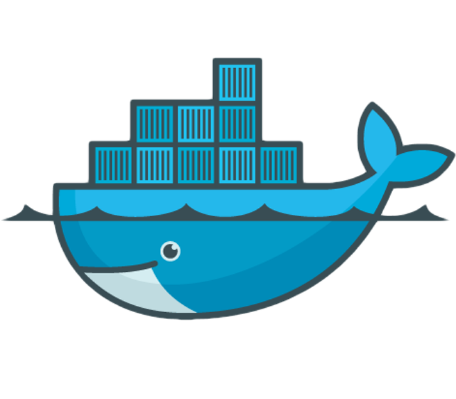
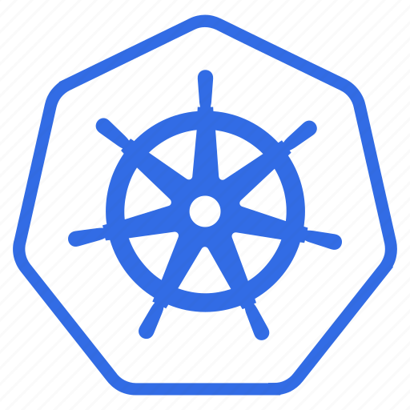

# ben.wangz's blog

## documents

   

        <a class="menu-item-title">USEFUL COMMANDS</a>
        

            
            <a class="menu-item-text" href="/#/commands/README">
                a set of commands for shell, java, git and so on
            </a>
        

    

    

        <a class="menu-item-title">QEMU</a>
        

            
            <a class="menu-item-text" href="/#/qemu/README">
                QEMU is a generic and open source machine & userspace emulator and virtualizer
            </a>
        

    

    

        <a class="menu-item-title">LINUX</a>
        

            
            <a class="menu-item-text" href="/#/linux/README">
                Linux is a family of open-source Unix-like operating systems based on the Linux kernel, 
                    an operating system kernel first released by Linus Torvalds
            </a>
        

    

    

        <a class="menu-item-title">DOCKER</a>
        

            
            <a class="menu-item-text" href="/#/docker/README">
                Docker is a set of platform as a service (PaaS) products 
                    that use OS-level virtualization to deliver software in packages called containers
            </a>
        

    

    

        <a class="menu-item-title">KUBERNETES</a>
        

            
            <a class="menu-item-text" href="/#/kubernetes/README">
                Kubernetes is an open-source system for automating deployment, 
                    scaling, and management of containerized applications
            </a>
        

    

    

## github projects

1. [docker in docker with sshd](https://github.com/ben-wangz/docker-dind-sshd)
2. [docker image of centos with systemd and sshd](https://github.com/ben-wangz/docker-systemd)
3. [greenplum docker image](https://github.com/ben-wangz/greenplum-docker):
   support singleton and cluster but just suitable for testing
4. [docker image of novnc client](https://github.com/ben-wangz/docker-novnc)
5. [docs for ants](https://github.com/ben-wangz/ant-doc): Yes, I treat ants as pets.

## about us

1. [about this site](about_site.md)
2. [about me](ben.wangz.md)

## others

1. [mirror sites from website](mirror.sites.from.website.md)

---

    <a style="font-family: SimSun, serif" href="https://beian.miit.gov.cn/">浙ICP备2021024222号</a>

