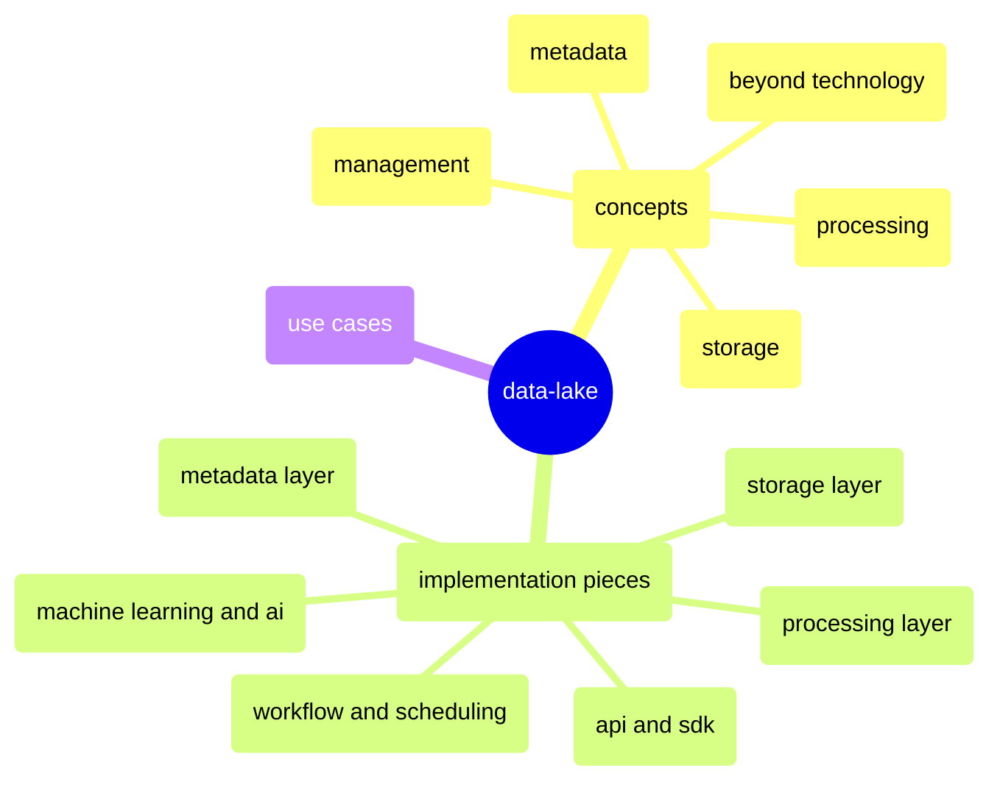

## mindmap

## what's a data lake
* A data lake is a centralized repository that allows you to store all your structured and unstructured data at any scale
* It's a concept, similar to cloud computing, but not a specifc technology
* It's an architectural approach that allows enterprises consolidate large heterogeneous data assets at scale and uncover actionable insights from the consolidated data through various types of analytics

## concepts
1. storage
    * storage is a fundamental component of any data lake
    * data lakes should be able to store structured, semi-structured, and unstructured data
    * in usual, data lakes are built on scalable and elastic storage
    * it's very important to integrate with other storage systems for a data lake to accessing and analyzing data from different sources
2. processing
    * data lakes should be able to process data at big scale
    * data lakes may support both batch processing and stream processing
    * data lakes should support different processing methods, such as SQL, piece of code, etc.
3. metadata
    * it's a key fundamental component of a data lake which keeps track of all the data assets
    * metadata is used to discover, understand, and govern data
    * features for metadata management including
        + auto-discovery
        + auto-classification
        + auto-tagging
        + data lineage
        + user customization
4. management
    * data governance
    * data lifecycle management
    * data security
    * data privacy
5. beyond technology

## implementation pieces
1. storage layer
    * features
        + store binary files with s3-compatible storage
        + store tables with s3-compatible storage or databases
    * use `s3-compatible storage`, such as minio, to store files
        + minio: [docker](../docker/software/storage/minio.md) | [k8s](../kubernetes/argocd/storage/minio/README.md)
    * use `clickhouse` to store tables
        + [docker](../docker/software/database/clickhouse.md) | [k8s](../kubernetes/argocd/database/clickhouse/README.md)
        + why clickhouse?
            1. it's a column-oriented database management system
            2. merge tree engine is powerful to store and query time series data
            3. support a lot of different engines to connect to other storage systems, such as s3, kafka, postgresql, etc.
            4. support multiple interfaces to pretend it as another (common) database, such as PostgreSQL interface and MySQL interface
            5. easy to integrate with flink cdc to capture changes from other databases/systems through jdbc
2. processing layer
    * features
        + views through other databases or systems
            * logical views
            * timely updated physical views
            * real-time physical views
        + easy to analyze data between multiple data(across files and tables)
        + easy to integrate with algorithms
            * with remote calls: grpc or rest api
            * with local invokes: apache arrow
    * use `flink` as the processing engine
        + basic tutorials
        + [flink on k8s](../kubernetes/argocd/flink/README.md)
        + basic connectors
            1. [s3 filesystem connector(source/sink) with parquet format](https://github.com/ben-wangz/blog/blob/main/flink/connectors/s3/README.md)
            2. [jdbc connector(source/sink)](https://github.com/ben-wangz/blog/blob/main/flink/connectors/jdbc/README.md)
                * NOTE: source is implemented by `InputFormat`
        + cdc connectors
            1. [postgresql connector(source/sink)]()
            2. [kafka connector(source/sink)]()
3. metadata layer
    * features
        + auto-discovery
        + auto-tagging(including classification)
        + data-lineage
        + user-customization
        + easy to search data
        + easy to fetch data
        + easy to analyze data
    * use `datahub` as meta data backend
4. workflow and scheduling
    * argo workflow
    * easy to construct a pipeline through yaml, flink jobs and container images
5. api and sdk
    * self developed
6. machine learning and ai

<AutoCatalog />