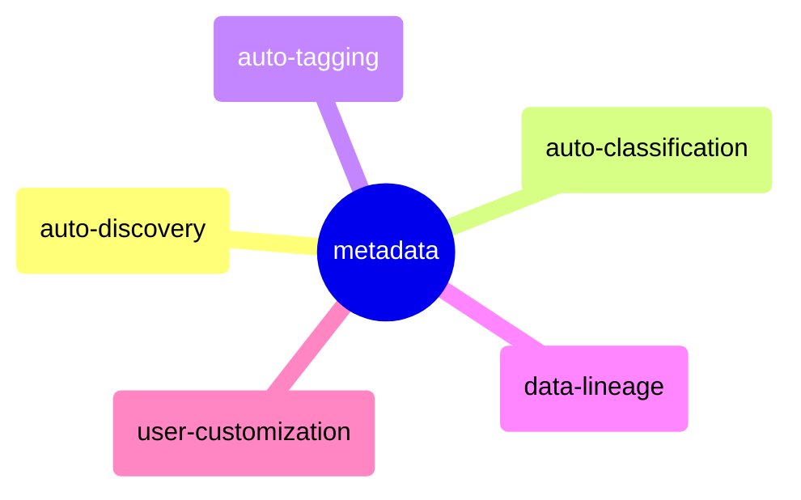

# metadata

## mindmap

## auto-discovery
1. auto-discovery is the process of automatically discovering data assets in a data lake.
2. metadata collection should be automated as possible from sources like databases, files through crawlers. This feeds into the catalog.

## auto-classification
1. auto-classification is the process of automatically classifying data assets in a data lake.
2. metadata should be classified automatically based on the content of the data. This helps in data governance and data security.
3. using machine learning techniques to classify data assets is a good way to achieve auto-classification.

## auto-tagging
1. auto-tagging is the process of automatically tagging data assets in a data lake.
2. identify commonly used terms, business glossary etc. to apply relevant tags to aid searchability.
3. auto-tagging can be achieved using machine learning techniques.

## data-lineage
1. data lineage is the process of tracking the data from its source to its destination.
2. the data lineage should be automatically tracked and maintained in the metadata.
3. it can be achieved by injecting metadata recording layer to the data processing tasks and the data storage tasks.

## user-customization
1. it's important to allow admin and users to manually tag, classify assets.
2. it's also the key solutions to handle the cases that auto-classification and auto-tagging can't handle.