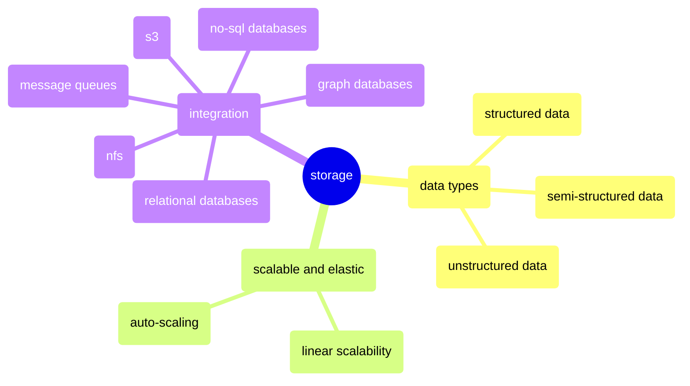

# storage

## mindmap

## data types
1. there are so many structured data types. no data lake can support all of them. 
2. but a data lake probably will support the most popular ones, such as
    * csv: Comma Separated Values file is one of the most common and widely used data formats to store tabular data.
    * json: JavaScript Object Notation has become a standard for transmitting and storing data. JSON is easy to parse and flexible to read and write for APIs.
    * parquet: Columnar storage format allows very efficient compression and encoding schemes saving storage space. Works well with distributed processing frameworks.
    * avro: Avro data files provide both a compact binary data format and container file format to bundle many records. Avro schemas help define the structure.
    * orc: Optimized Row Columnar file format is ideal for storing Hive, Spark SQL query results and fast reads. Primarily used in Hadoop ecosystems.
    * arrow: Apache Arrow defines a language-independent columnar memory format for flat and hierarchical data. Arrow IPC(Arrow Inter-Process Communication format) can be considered an open standard for high performance columnar data I/O.

## scalable and elastic
1. designing the underlying storage of the data lake to be scalable and elastic is crucial to support the ever growing amounts of data.
2. choosing a good storage system is critical to ensure the data lake can scale.
    * s3: Amazon S3 is a scalable, high-speed, web-based cloud storage service designed for online backup and archiving of data and application programs.
    * cloud based nfs: NFS is a distributed file system protocol allowing a user on a client computer to access files over a network in a manner similar to how local storage is accessed.
    * Ceph File System: Ceph is a distributed object store and file system designed to provide excellent performance, reliability and scalability. In addition, it's an open source software storage platform that implements object storage, block storage and POSIX-compliant distributed file system in one unified system. 
    * GlusterFS: GlusterFS is a scalable network file system suitable for data-intensive tasks such as cloud storage and media streaming.
3. decouple storage from compute: allow storage and compute capacity to scale independently. Add compute on demand for processing needs without being limited to data volume constraints.
4. auto-scaling: the storage system should be able to scale automatically based on the amount of data or i/o requests.
5. linear scalability: linear scaling may be the best efficient of storage scaling.

## integration
1. it's very important to integrate with other storage systems for a data lake to accessing and analyzing data from different sources.
2. the choices of which storage systems to integrate with are critical to the ROI(Return on Investment) of the data lake.
3. most common external storage systems
    * s3
    * relational databases
    * no-sql databases
    * graph databases
    * message queues
    * nfs
