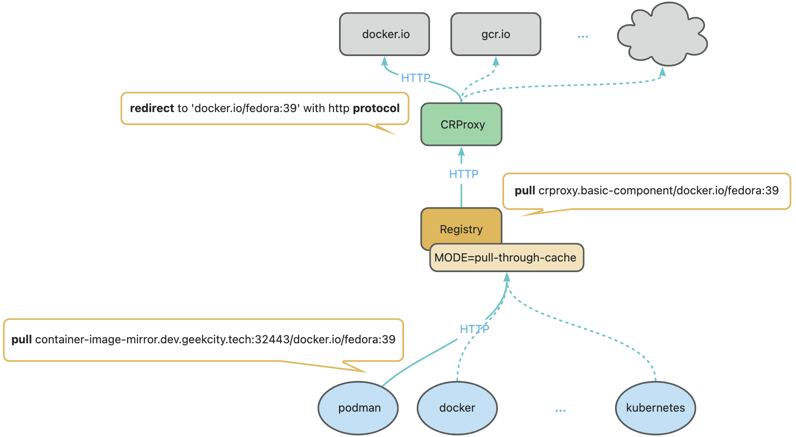

# container-image-mirror

## logic

* inspired by [wzshiming](https://github.com/wzshiming)
* 
* references
    + https://github.com/DaoCloud/crproxy
    + https://docs.docker.com/docker-hub/mirror/
    + https://github.com/twuni/docker-registry.helm

## installation

1. setup crproxy
    * ```shell
      podman run --restart always --name crproxy -p 8080:8080 -d ghcr.io/daocloud/crproxy/crproxy:v0.8.0
      ```
2. setup registry with pull through cache mode
    * ```shell
      CRPROXY_URL=http://host.containers.internal:8080
      mkdir -p registry/data
      podman run --name registry --restart always \
          -p 5000:5000 \
          -v $(pwd)/registry/data:/data \
          -e REGISTRY_STORAGE_FILESYSTEM_ROOTDIRECTORY=/data \
          -e REGISTRY_PROXY_ENABLED=true \
          -e REGISTRY_PROXY_REMOTEURL=$CRPROXY_URL \
          -d docker.io/library/registry:2
      ```
3. issue a certificate with letsencrypt acme.sh
    * make sure the domain `mirror.registry.container.dev.geekcity.tech` is resolved to the host
    * make sure the port 80 is open
    * ```shell
      mkdir -p letsencrypt/acme-output
      podman run --rm \
          -p 80:80 \
          -v "$(pwd)/letsencrypt/acme-output":/acme.sh \
          docker.io/neilpang/acme.sh:3.1.0 --issue \
              -d mirror.registry.container.dev.geekcity.tech \
              --server letsencrypt \
              --standalone
      ```
4. install the certificate into haproxy
    * ```shell
      mkdir -p haproxy/pem
      CERTIFICATE_PATH=$(pwd)/letsencrypt/acme-output/mirror.registry.container.dev.geekcity.tech_ecc
      HA_PROXY_CERTIFICATE_PATH=$(pwd)/haproxy/pem
      cat $CERTIFICATE_PATH/fullchain.cer $CERTIFICATE_PATH/mirror.registry.container.dev.geekcity.tech.key > $HA_PROXY_CERTIFICATE_PATH/mirror.registry.container.dev.geekcity.tech.pem
      ```
5. setup haproxy
    * prepare `haproxy/haproxy.cfg`
        + ```yaml
          <!-- @include: haproxy.cfg -->
          ```
    * ```shell
      podman run --restart always \
          --name haproxy \
          -p 1443:443 \
          -p 1080:80 \
          -v $(pwd)/haproxy/pem:/usr/local/etc/haproxy/certs/:ro \
          -v $(pwd)/haproxy/haproxy.cfg:/usr/local/etc/haproxy/haproxy.cfg:ro \
          -d docker.io/library/haproxy:2.2.14
      ```

## tests

1. pull the image from the mirror
    * ```shell
      podman pull mirror.registry.container.dev.geekcity.tech:1443/docker.io/library/alpine:latest
      ```
2. check data exists in the registry
    * ```shell
      ls -l $(pwd)registry/data/docker/registry/v2/repositories/docker.io/library/alpine/_manifests/tags/
      ```
