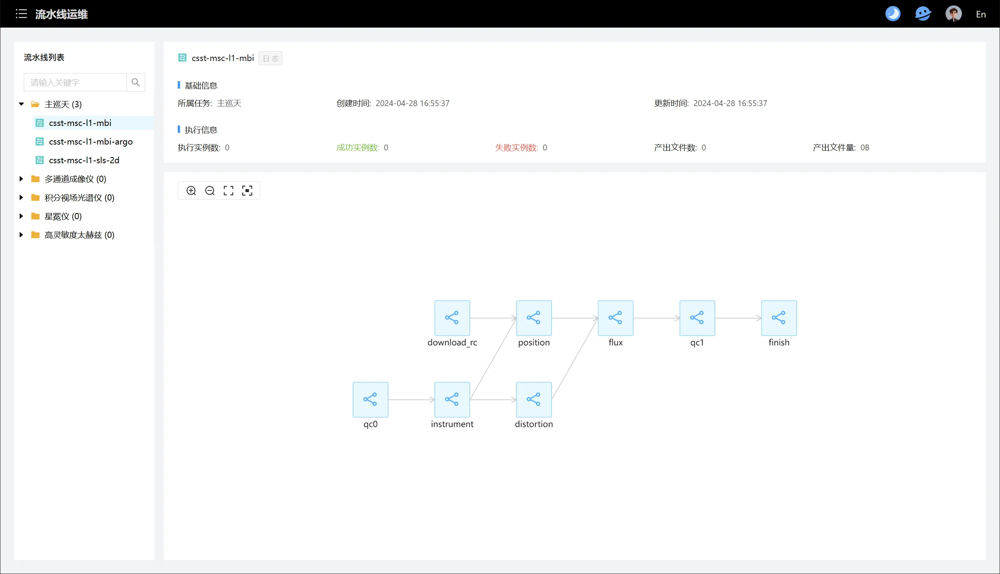

# projects

## astronomy center of ZhejiangLab

## CSST

### introduction

* website: https://astro-workbench.zero2x.org/
* hand manual: https://www.yuque.com/tianpin-aqb6e/hdwuhf/kicx3mgllp84ga77
* The Astronomical Scientific Research Workstation is a universal astronomical data computing platform driven by the China Space Station Telescope (CSST). Its core objective is to establish the CSST Data Science Center. The platform integrates CSST data and provides user interfaces to assist researchers in managing data processing pipelines, while also offering a suite of intelligent agent tools to support astronomical teams in conducting CSST pre-research work. Beyond supporting the CSST mission, the platform also incorporates FAST scientific data and related domain models, introduces knowledge bases in areas such as astrochemistry, fast radio bursts, transient sources, and neutral hydrogen, and integrates a multi-wavelength data fusion platform to provide support for broader astronomical scientific research.
* example images
    + 

### techniques provided by us

1. metadata
2. storage
3. star catalog
4. workflows
5. slurm on k8s
6. codespace
7. cicd: actions and standard service
8. middleware softwares
9. monitoring

## FAST

### introduction

### techniques provided by us

1. metadata
2. storage
3. workflows
4. cicd: actions and standard service
5. middleware softwares
6. monitoring

## LHAASO

### introduction

### techniques provided by us

1. storage
2. workflows
3. codespace

## cnSRC@SRCNet of SKA

### introduction

### techniques provided by us

1. k8s environment
2. storage
3. workflows
4. monitoring
