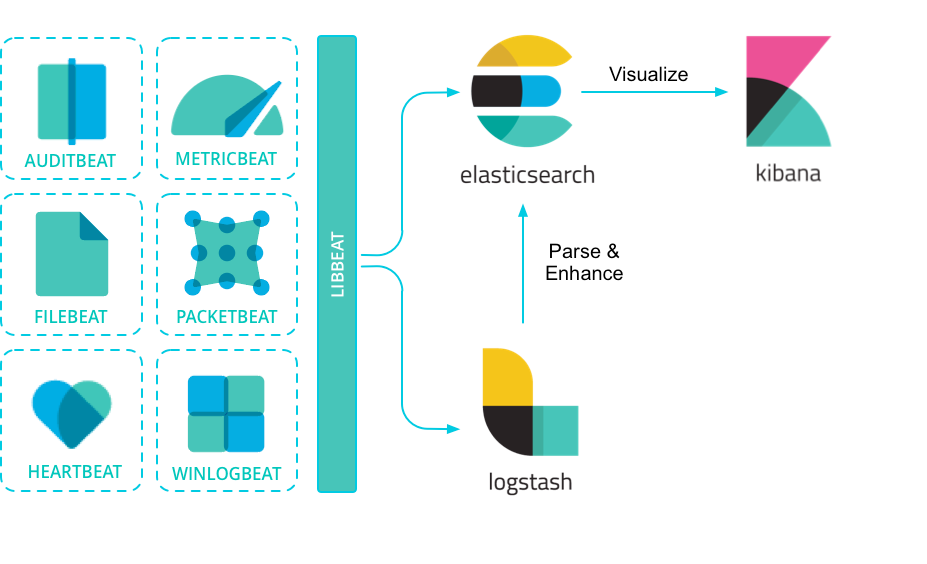

# elk stack

## main usage

* collect logs generated by pods in k8s
* send logs to elasticsearch and visualized by kibana in real time

## conceptions

* relationships between the "elk stack" components
    + image is referenced from
      [beats-reference](https://www.elastic.co/guide/en/beats/libbeat/current/beats-reference.html)
    + 

## purpose

* prepare a kind cluster with basic components(one master and three workers)
* setup elk stack
    * elasticsearch
    * kibana
    * filebeat
* test with "java-log-generator" from https://github.com/Febbweiss/docker-java-log-generator
    + docker image: `febbweiss/java-log-generator:latest`

## installation

1. [prepare a kind cluster with basic components](../basic/kind.cluster.md)
    * modify `kind.cluster.yaml` to [kind.cluster.with.3.workers.yaml](../resources/kind.cluster.with.3.workers.yaml.md)
    * add hosts info to every worker node(master node has already been added)
        + ```shell
          for NODE in "kind-worker" "kind-worker2" "kind-worker3"
          do
              docker exec $NODE bash -c 'echo 172.17.0.1 docker.registry.local >> /etc/hosts' \
                  && docker exec $NODE bash -c 'echo 172.17.0.1 insecure.docker.registry.local >> /etc/hosts' \
                  && docker exec $NODE bash -c 'echo 172.17.0.1 chart.museum.local >> /etc/hosts'
          done
          ```
2. download and load images to qemu machine(run command at the host of qemu machine)
    * run scripts
      in [download.and.load.function.sh](../resources/create.qemu.machine.for.kind/download.and.load.function.sh.md) to
      load function `download_and_load`
    * ```shell
      TOPIC_DIRECTORY="elk.stack.monitor"
      BASE_URL="https://resource.geekcity.tech/kubernetes/docker-images/x86_64"
      download_and_load $TOPIC_DIRECTORY $BASE_URL \
          "docker.io_docker.elastic.co_elasticsearch_elasticsearch_7.16.3.dim" \
          "docker.io_docker.elastic.co_kibana_kibana_7.16.3.dim" \
          "docker.io_docker.elastic.co_beats_filebeat_7.16.3.dim" \
          "docker.io_febbweiss_java-log-generator_latest.dim"
      ```
3. configure self-signed issuer
    * `self-signed` issuer
        + prepare [self.signed.and.ca.issuer.yaml](../basic/resources/cert.manager/self.signed.and.ca.issuer.yaml.md)
        + ```shell
          kubectl get namespace monitor > /dev/null 2>&1 || kubectl create namespace monitor \
              && kubectl -n monitor apply -f self.signed.and.ca.issuer.yaml
          ```
4. install elasticsearch
    * prepare [elasticsearch.values.yaml](resources/elk.stack/elasticsearch.values.yaml.md)
    * prepare images
        + run scripts in [load.image.function.sh](../resources/load.image.function.sh.md) to load function `load_image`
        + ```shell
          load_image "docker.registry.local:443" \
              "docker.io/docker.elastic.co/elasticsearch/elasticsearch:7.16.3"
          ```
    * install by helm
        + ```shell
          helm install \
              --create-namespace --namespace monitor \
              my-elasticsearch \
              https://resource.geekcity.tech/kubernetes/charts/https/helm.elastic.co/elasticsearch-7.16.3.tgz \
              --values elasticsearch.values.yaml \
              --atomic
          ```
    * check connection
        + ```shell
          curl --insecure --header 'Host: elasticsearch.local' https://localhost
          ```
5. install kibana
    * prepare [kibana.values.yaml](resources/elk.stack/kibana.values.yaml.md)
    * prepare images
        + run scripts in [load.image.function.sh](../resources/load.image.function.sh.md) to load function `load_image`
        + ```shell
          load_image "docker.registry.local:443" \
              "docker.io/docker.elastic.co/kibana/kibana:7.16.3"
          ```
    * install by helm
        + ```shell
          helm install \
              --create-namespace --namespace monitor \
              my-kibana \
              https://resource.geekcity.tech/kubernetes/charts/https/helm.elastic.co/kibana-7.16.3.tgz \
              --values kibana.values.yaml \
              --atomic
          ```
    * check connection
        + ```shell
          curl --insecure --header 'Host: kibana.local' https://localhost/app/home
          ```
6. install filebeat
    * prepare [filebeat.values.yaml](resources/elk.stack/filebeat.values.yaml.md)
    * prepare images
        + run scripts in [load.image.function.sh](../resources/load.image.function.sh.md) to load function `load_image`
        + ```shell
          load_image "docker.registry.local:443" \
              "docker.io/docker.elastic.co/beats/filebeat:7.16.3"
          ```
    * install by helm
        + ```shell
          helm install \
              --create-namespace --namespace monitor \
              my-filebeat \
              https://resource.geekcity.tech/kubernetes/charts/https/helm.elastic.co/filebeat-7.16.3.tgz \
              --values filebeat.values.yaml \
              --atomic
          ```
    * wait for all pods to be ready
        + ```shell
          kubectl -n monitor wait --for=condition=ready pod --all
          ```

## test

1. apply application named `log-generator` by `deployment`
    * prepare [log.generator.yaml](resources/elk.stack/log.generator.yaml.md)
    * prepare images
        + run scripts in [load.image.function.sh](../resources/load.image.function.sh.md) to load function `load_image`
        + ```shell
          load_image "docker.registry.local:443" \
              "docker.io/febbweiss/java-log-generator:latest"
          ```
    * apply to k8s cluster
        + ```shell
          kubectl get namespace test > /dev/null 2>&1 || kubectl create namespace test \
              && kubectl -n test apply -f log.generator.yaml
          ```
2. check connection
    * ```shell
      curl --insecure --header 'Host: elasticsearch.local' https://localhost
      ```
3. create read only `user`
4. visit gitea via website
5. filter with KQL
    + ```KQL
      kubernetes.labels.app : log-generator and message : *com.github.vspiewak.loggenerator.SearchRequest*
      ```

## uninstallation

1. uninstall `elasticsearch`
    * ```shell
      helm -n monitor uninstall my-elasticsearch
      ```