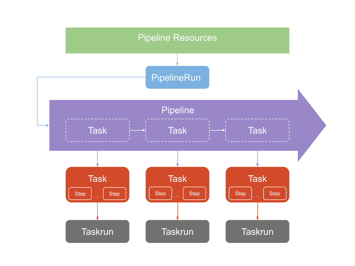

# tekton

## main usage

* a cloud-native solution for building CI/CD systems
* Tekton Pipelines, which provides the building blocks, and of supporting components, such as Tekton CLI and Tekton
  Catalog, that make Tekton a complete ecosystem.

## conceptions

* tekton decoupled architecture, from https://technologists.dev/posts/tekton-jx-pipelines/
    + 
* in this example(test)
    + pipeline
        * Basic building blocks (tasks and pipelines) of a CI/CD workflow
        * consists of
            + resources
                * objects that are going to be used as `inputs`/`outputs` of a `task`
            + results
                * a `task` can generate a result by adding files to `/tekton/results`
            + params
                * can be replaced by the values of params in the `taskRun`
            + workspaces
            + tasks
                * a task consists of
                    + `name` and `taskRef`
                    + dependencies(defined by `runAfter`)
                    + `params`
                    + `workspaces`
                    + `resources`: `inputs` and `outputs`
        * `$` can be used to address some definitions
            + `$(tasks.pipeline-git-source.results.dockerfile-path)` represents the `dockerfile-path` in the `result`
              of `task` named `pipeline-git-source`
    + trigger
        * Event triggers for a CI/CD workflow

## purpose

* prepare a kind cluster with basic components
* install `tekton`
* test `tekton`
    + test `task` and `taskRun`
    + test `pipeline` and `pipelineRun`
        * git clone
        * build docker image
        * push docker image
    + achieving `trigger` a `pipeline` with git push operation(cooperate with `gitea`)
    + optional, test with webhook

## installation

1. [prepare a kind cluster with basic components](../basic/kind.cluster.md)
2. download and load images to qemu machine(run command at the host of qemu machine)
    * run scripts
      in [download.and.load.function.sh](../resources/create.qemu.machine.for.kind/download.and.load.function.sh.md) to
      load function `download_and_load`
    * ```shell
      TOPIC_DIRECTORY="tekton.software"
      BASE_URL="https://resource.geekcity.tech/kubernetes/docker-images/x86_64"
      download_and_load $TOPIC_DIRECTORY $BASE_URL \
          "docker.io_gcr.io_tekton-releases_github.com_tektoncd_operator_cmd_kubernetes_proxy-webhook_v0.54.0.dim" \
          "docker.io_gcr.io_tekton-releases_dogfooding_tkn_latest-025de2.dim" \
          "docker.io_gcr.io_tekton-releases_github.com_tektoncd_operator_cmd_kubernetes_operator_v0.54.0.dim" \
          "docker.io_gcr.io_tekton-releases_github.com_tektoncd_operator_cmd_kubernetes_webhook_v0.54.0.dim" \
          "docker.io_busybox_1.33.1-uclibc.dim" \
          "docker.io_bitnami_git_2.35.1-debian-10-r44.dim" \
          "docker.io_docker_20.10.13-dind-alpine3.15.dim" \
          "docker.io_alpine_3.15.0.dim"
      ```
3. configure self-signed issuer
    * `self-signed` issuer
        + prepare [self.signed.and.ca.issuer.yaml](../basic/resources/cert.manager/self.signed.and.ca.issuer.yaml.md)
        + ```shell
          kubectl get namespace tekton-operator > /dev/null 2>&1 || kubectl create namespace tekton-operator \
              && kubectl -n tekton-operator apply -f self.signed.and.ca.issuer.yaml
          ```
4. prepare images
    * NOTE: `tekton-operator-v0.54.0` not support custom registry for components according
      to [issue #625](https://github.com/tektoncd/operator/issues/625)
    * run scripts in [load.image.function.sh](../resources/load.image.function.sh.md) to load function `load_image`
    * ```shell
      load_image "docker.registry.local:443" \
          "docker.io/gcr.io/tekton-releases/github.com/tektoncd/operator/cmd/kubernetes/proxy-webhook:v0.54.0" \
          "docker.io/gcr.io/tekton-releases/dogfooding/tkn:latest-025de2" \
          "docker.io/gcr.io/tekton-releases/github.com/tektoncd/operator/cmd/kubernetes/operator:v0.54.0" \
          "docker.io/gcr.io/tekton-releases/github.com/tektoncd/operator/cmd/kubernetes/webhook:v0.54.0"
      ```
    * load images at every node in cluster
        + ```shell
          DOCKER_IMAGE_PATH=/root/docker-images/tekton.software/all-nodes && mkdir -p $DOCKER_IMAGE_PATH
          BASE_URL="https://resource.geekcity.tech/kubernetes/docker-images/x86_64/tekton.software/all-nodes"
          for IMAGE in "docker.io_gcr.io_tekton-releases_github.com_tektoncd_pipeline_cmd_entrypoint_v0.32.0.dim" \
              "docker.io_gcr.io_tekton-releases_github.com_tektoncd_dashboard_cmd_dashboard_v0.23.0.dim" \
              "docker.io_gcr.io_tekton-releases_github.com_tektoncd_pipeline_cmd_kubeconfigwriter_v0.32.0.dim" \
              "docker.io_gcr.io_tekton-releases_github.com_tektoncd_pipeline_cmd_git-init_v0.32.0.dim" \
              "docker.io_gcr.io_tekton-releases_github.com_tektoncd_pipeline_cmd_nop_v0.32.0.dim" \
              "docker.io_gcr.io_tekton-releases_github.com_tektoncd_pipeline_cmd_imagedigestexporter_v0.32.0.dim" \
              "docker.io_gcr.io_tekton-releases_github.com_tektoncd_pipeline_cmd_pullrequest-init_v0.32.0.dim" \
              "docker.io_gcr.io_tekton-releases_github.com_tektoncd_pipeline_cmd_controller_v0.32.0.dim" \
              "docker.io_gcr.io_tekton-releases_github.com_tektoncd_triggers_cmd_controller_v0.18.0.dim" \
              "docker.io_gcr.io_tekton-releases_github.com_tektoncd_pipeline_cmd_webhook_v0.32.0.dim" \
              "docker.io_gcr.io_tekton-releases_github.com_tektoncd_triggers_cmd_webhook_v0.18.0.dim" \
              "docker.io_gcr.io_tekton-releases_github.com_tektoncd_triggers_cmd_eventlistenersink_v0.18.0.dim" \
              "docker.io_gcr.io_tekton-releases_github.com_tektoncd_triggers_cmd_interceptors_v0.18.0.dim"
          do
              IMAGE_FILE=$DOCKER_IMAGE_PATH/$IMAGE
              if [ ! -f $IMAGE_FILE ]; then
                  TMP_FILE=$IMAGE_FILE.tmp \
                      && curl -o "$TMP_FILE" -L "$BASE_URL/$IMAGE" \
                      && mv $TMP_FILE $IMAGE_FILE
              fi
              docker image load -i $IMAGE_FILE
          done
          ```
    * load them into all nodes of kind cluster if kind environment specified
        + ```shell
          for IMAGE in "docker.io/gcr.io/tekton-releases/github.com/tektoncd/pipeline/cmd/entrypoint:v0.32.0" \
              "docker.io/gcr.io/tekton-releases/github.com/tektoncd/dashboard/cmd/dashboard:v0.23.0" \
              "docker.io/gcr.io/tekton-releases/github.com/tektoncd/pipeline/cmd/kubeconfigwriter:v0.32.0" \
              "docker.io/gcr.io/tekton-releases/github.com/tektoncd/pipeline/cmd/git-init:v0.32.0" \
              "docker.io/gcr.io/tekton-releases/github.com/tektoncd/pipeline/cmd/nop:v0.32.0" \
              "docker.io/gcr.io/tekton-releases/github.com/tektoncd/pipeline/cmd/imagedigestexporter:v0.32.0" \
              "docker.io/gcr.io/tekton-releases/github.com/tektoncd/pipeline/cmd/pullrequest-init:v0.32.0" \
              "docker.io/gcr.io/tekton-releases/github.com/tektoncd/pipeline/cmd/controller:v0.32.0" \
              "docker.io/gcr.io/tekton-releases/github.com/tektoncd/triggers/cmd/controller:v0.18.0" \
              "docker.io/gcr.io/tekton-releases/github.com/tektoncd/pipeline/cmd/webhook:v0.32.0" \
              "docker.io/gcr.io/tekton-releases/github.com/tektoncd/triggers/cmd/webhook:v0.18.0" \
              "docker.io/gcr.io/tekton-releases/github.com/tektoncd/triggers/cmd/eventlistenersink:v0.18.0" \
              "docker.io/gcr.io/tekton-releases/github.com/tektoncd/triggers/cmd/interceptors:v0.18.0"
          do
              kind load docker-image $IMAGE
          done
          ```
5. install `tekton-operator`
    * prepare [tekton_operator_v0.54.0_release.yaml](resources/tekton/tekton_operator_v0.54.0_release.yaml.md)
    * install
        + ```shell
          kubectl -n tekton-operator apply -f tekton_operator_v0.54.0_release.yaml
          ```
    * wait for pods to be ready
        + ```shell
          kubectl -n tekton-operator wait --for=condition=ready pod --all
          ```
6. install components of `tekton`
    * prepare [tekton.config.yaml](resources/tekton/tekton.config.yaml.md)
    * install
        + ```shell
          kubectl -n tekton-operator apply -f tekton.config.yaml
          ```
    * prepare [tekton.ingress.yaml](resources/tekton/tekton.ingress.yaml.md)
    * apply ingress for `tekton-dashboard`
        + ```shell
          kubectl -n tekton-pipelines apply -f tekton.ingress.yaml
          ```
    * TODO ingress of tekton-pipelines-webhook.tekton-pipelines
    * TODO ingress of tekton-triggers-webhook.tekton-pipelines
    * wait for all pods to be ready
        + ```shell
          # NOTE: wait command will be blocked by pods named `tekton-resource-pruner-...` which scheduled by jobs
          kubectl -n tekton-pipelines get pod
          ```

## test

1. check connection of `tekton-dashboard`
    * ```shell
      curl --insecure --header 'Host: tekton-dashboard.local' https://localhost
      ```
2. visit `https://tekton-dashboard.local`
3. test `task`
    * prepare [tekton.build.task.yaml](resources/tekton/tekton.build.task.yaml.md)
    * prepare images
        + run scripts in [load.image.function.sh](../resources/load.image.function.sh.md) to load function `load_image`
        + ```shell
          load_image "docker.registry.local:443" \
              "docker.io/busybox:1.33.1-uclibc"
          ```
    * apply task(s)
        + ```shell
          kubectl -n tekton-pipelines apply -f tekton.build.task.yaml
          ```
    * prepare [tekton.build.task.run.yaml](resources/tekton/tekton.build.task.run.yaml.md)
    * run build task
        + ```shell
          kubectl -n tekton-pipelines create -f tekton.build.task.run.yaml
          ```
    * check `taskRun` by visiting `https://tekton-dashboard.local`
4. test `pipeline`
    * prepare [tekton.pipeline.yaml](resources/tekton/tekton.pipeline.yaml.md)
    * prepare images
        + run scripts in [load.image.function.sh](../resources/load.image.function.sh.md) to load function `load_image`
        + ```shell
          load_image "docker.registry.local:443" \
              "docker.io/bitnami/git:2.35.1-debian-10-r44" \
              "docker.io/docker:20.10.13-dind-alpine3.15" \
              "docker.io/alpine:3.15.0"
          ```
    * prepare ssh-key-secret
        + create `rsa keys` by `ssh-keygen` if not generated before
            * ```shell
              mkdir -p ssh-keys/ \
                  && ssh-keygen -t rsa -b 4096 -N "" -f ssh-keys/id_rsa
              ```
        + generate `git-ssh-key-secret`
            * ```shell
              kubectl -n tekton-pipelines create secret generic git-ssh-key-secret --from-file=ssh-keys/
              ```
    * add `ssh-keys/id_rsa.pub` to git repo server as deploy key
    * apply pipeline
        + ```shell
          kubectl -n tekton-pipelines apply -f tekton.pipeline.yaml
          ```
    * prepare [tekton.pipeline.run.yaml](resources/tekton/tekton.pipeline.run.yaml.md)
    * run publish task
        + ```shell
          kubectl -n tekton-pipelines create -f tekton.pipeline.run.yaml
          ```
5. test `webhook`
    * TODO
    * run task
    * run pipeline
    * fetch logs of task
    * fetch logs of pipeline

## uninstallation

1. uninstall `tekton`
    * ```shell
      kubectl -n tekton-operator delete -f tekton.config.yaml
      kubectl -n tekton-operator delete -f tekton_operator_v0.54.0_release.yaml
      ```

## TODO waiting for updates

1. use images from private registry
2. persist volume
3. native ingress
